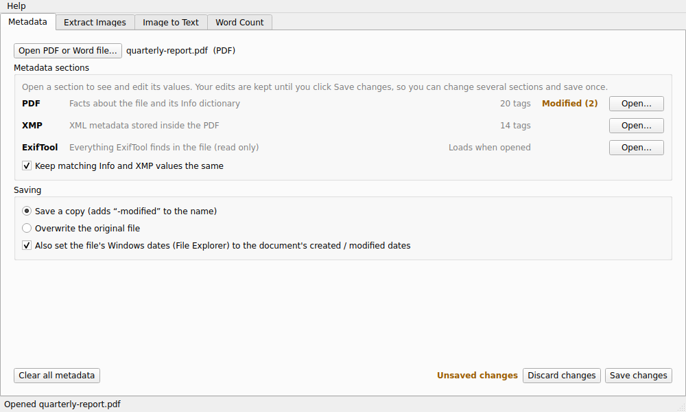
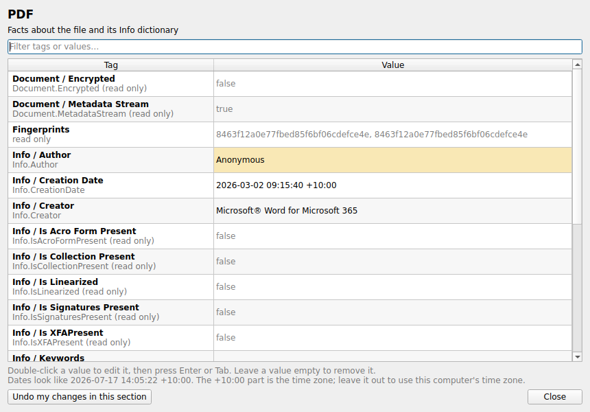

# DocToolkit

A free Windows app for PDF and Word files. It edits and removes metadata, extracts images, reads text from images (English and Arabic) and counts words.

Everything runs on your own computer. No file is ever uploaded.



## Download

1. Open the [latest release](../../releases/latest).
2. Under **Assets**, download **DocToolkit-*version*-windows.zip**.
3. Right-click the ZIP and choose **Extract All**. Then open the **DocToolkit** folder and double-click **DocToolkit.exe**.

You don't need admin rights, and you don't need to install Python or anything else: the text-reading engine (Tesseract) is included.

Keep **DocToolkit.exe** inside its folder, because it needs the `_internal` folder next to it. For a desktop shortcut, right-click **DocToolkit.exe** and choose **Show more options**, then **Send to**, then **Desktop (create shortcut)**.

> **"Windows protected your PC"?** Windows shows this for new apps that aren't signed with a paid certificate. Click **More info**, then **Run anyway**.

## What it does

### Metadata
Open a PDF or Word (.docx) file to see its metadata in sections. Each section opens in its own window as a Tag / Value table.

- **PDF files:** *PDF* (facts about the file and its Info dictionary), *XMP* (the XML metadata inside the PDF) and *ExifTool* (a full report, read only).
- **Word files:** *Core properties* (title, author, comments, dates), *Application properties* (company, template, editing time), *Custom properties* and *ExifTool*.

Edit values in as many sections as you want. Edited sections are marked **Modified**, and one click on **Save changes** writes everything at once. **Clear all metadata** removes it all for privacy.



### Extract Images
Pull the images out of PDF and Word files and save the ones you choose.

### Image to Text
Pick images (or pages of a PDF), crop to the part you need, and extract the text in English or Arabic. Edit it, copy it, or save it as a .txt file.

### Word Count
See a picture of every page, pick pages (tick them or type a range like `1-5, 8`), and get the word and character count. For Word files, the pages are exact when Microsoft Word is installed and approximate otherwise.

## Privacy and safety

- Works fully offline. Nothing is uploaded or tracked.
- Extract Images and Word Count only read your files. They never change them.
- When saving metadata, DocToolkit changes only the values you edited. It never adds its own name, keeps password-protected PDFs protected, and never overwrites an existing file when saving a copy.
- A save writes a temporary file first, so a failed save can't damage your original.
- ExifTool is only used to read. When ExifTool edits a PDF, it adds the change at the end of the file, so old values can still be recovered. DocToolkit rewrites the whole file instead, so old values are really gone.

## Run from source

For developers. You need Windows 10 or 11, [Python](https://www.python.org/downloads/) 3.10 or newer, [Git](https://git-scm.com/) and [Tesseract](https://github.com/UB-Mannheim/tesseract/wiki). When installing Tesseract, tick **Arabic** under *Additional language data*.

In PowerShell:
```powershell
git clone https://github.com/SOoONB52/DocToolkit.git
cd DocToolkit
python -m venv venv
venv\Scripts\python -m pip install -r requirements.txt
venv\Scripts\python main.py
```
Next time, only the last line is needed (from inside the DocToolkit folder).

**ExifTool (optional):** the ExifTool report only works if ExifTool is present. Download the Windows version from [exiftool.org](https://exiftool.org), rename `exiftool(-k).exe` to `exiftool.exe`, and put it with its `exiftool_files` folder in a folder named `exiftool` inside the project folder.

## Project structure

```
main.py              starts the app
app/core/            the actual work: metadata, images, OCR, word count (no window code)
app/ui/              the main window, tabs and dialogs
app/i18n.py          all text shown in the app
app/assets/          the app icon
DocToolkit.spec      recipe for building the app with PyInstaller
docs/                screenshots for this page, and the icon's source drawings
```

## Built with

[PySide6 (Qt)](https://doc.qt.io/qtforpython/), [pikepdf](https://github.com/pikepdf/pikepdf) ([qpdf](https://github.com/qpdf/qpdf)), [pypdfium2](https://github.com/pypdfium2-team/pypdfium2) (PDFium), [lxml](https://lxml.de), [Pillow](https://python-pillow.org), [pytesseract](https://github.com/madmaze/pytesseract) with [Tesseract OCR](https://github.com/tesseract-ocr/tesseract), [pywin32](https://github.com/mhammond/pywin32), and optionally [ExifTool](https://exiftool.org). Their licenses are listed in [THIRD-PARTY-NOTICES.md](THIRD-PARTY-NOTICES.md).

## License

DocToolkit is released under the [MIT License](LICENSE).

## Author

Developed by **Tariq Alanazi**, SOoONB52an@gmail.com
